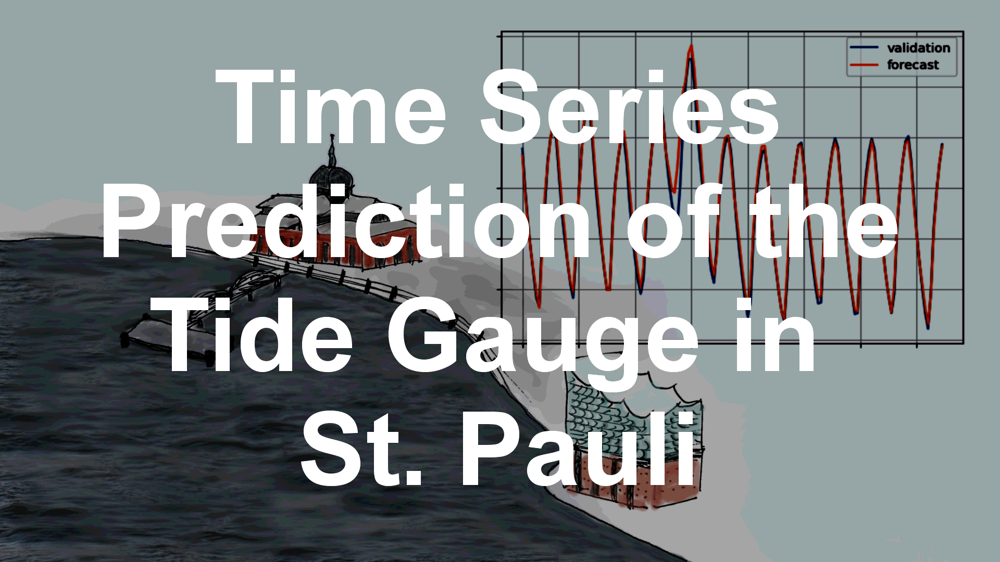

# Time Series Prediction of the Tide Gauge in St. Pauli

## Repository Link

[https://github.com/LudwigMeder/Time-Series-Prediction-of-the-Tide-Gauge-in-St.-Pauli]

## Description

The aim of this project is to predict the tide gauge in St. Pauli for a 6 hour window based on the previous 48 hours of tide measurements and the local wind field represented by wind measurements from the DWD station on Helgoland.

### Task Type

Time Series Prediction

### Results Summary

- **Best Model:** LSTM Model
- **Evaluation Metric:** RSME (root mean squared error)
- **Result:** RSME = 

## Documentation

1. **[Literature Review](0_LiteratureReview/README.md)**
2. **[Dataset Characteristics](1_DatasetCharacteristics/exploratory_data_analysis.ipynb)**
3. **[Baseline Model](2_BaselineModel/baseline_model.ipynb)**
4. **[Model Definition and Evaluation](3_Model/model_definition_evaluation)**
5. **[Presentation](4_Presentation/README.md)**

## Cover Image

